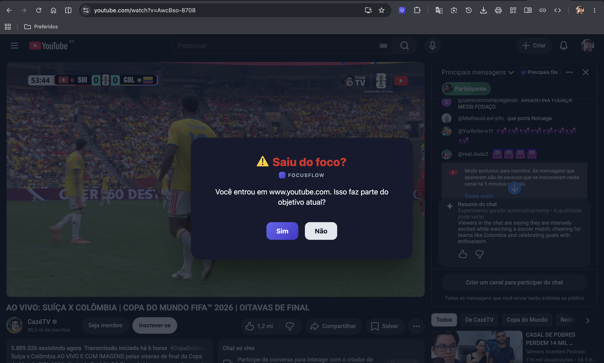

# FocusFlow

> Extensão de navegador (Chromium, Manifest V3) que ajuda você a perceber quando saiu do foco durante uma sessão de estudo ou trabalho. Sem IA, sem backend, 100% local: você define um objetivo, a extensão observa suas trocas de aba e pergunta — na hora certa — se aquele site faz parte do plano.

---

## 🛠️ Stack Principal


---

## 📑 Sumário

- [Sobre o projeto](#-sobre-o-projeto)
- [Como funciona](#-como-funciona)
- [Instalação e execução](#-instalação-e-execução)
- [Carregando a extensão no navegador](#-carregando-a-extensão-no-navegador)
- [Scripts disponíveis](#-scripts-disponíveis)
- [Estrutura do projeto](#-estrutura-do-projeto)
- [Documentação](#-documentação)
- [Stack e dependências](#-stack-e-dependências)

---

## 📖 Sobre o projeto

O **FocusFlow** ataca um problema bem específico: você abre o navegador com uma tarefa clara em mente, e algumas trocas de aba depois está no YouTube, no Instagram ou lendo notícias — sem nem perceber a transição. O produto não bloqueia nada e não usa inteligência artificial; ele apenas observa o domínio da aba ativa durante uma sessão e, quando você entra em um site da sua lista de distrações, pergunta: **"Isso faz parte do objetivo atual?"**

Essa pergunta de confirmação consciente é o coração do produto. Tudo mais — cronômetro, pontuação, histórico, configurações — existe para sustentar esse momento.

Princípios do produto:

- **Consciência, não bloqueio.** A extensão nunca impede o acesso a um site, só pergunta.
- **Fricção mínima.** Qualquer interação é resolvível em 1 clique.
- **100% local.** Todo o estado vive em `chrome.storage.local`; não há login, backend ou telemetria.
- **Regras simples e determinísticas.** Nada de IA ou heurística difusa — apenas lista de domínios + tempo + sua resposta.

---

## 🚀 Como funciona

<table>
  <tr>
    <td align="center" width="33%">
      <br/>
      <sub><b>1. Defina o objetivo</b><br/>escreva em uma frase o que você vai fazer e clique em "Iniciar sessão"</sub>
    </td>
    <td align="center" width="33%">
      <br/>
      <sub><b>2. Trabalhe normalmente</b><br/>o cronômetro roda em segundo plano, mesmo com o popup fechado</sub>
    </td>
    <td align="center" width="33%">
      <br/>
      <sub><b>3. Receba o alerta</b><br/>ao entrar num site da lista, a extensão pergunta se aquilo faz parte do objetivo</sub>
    </td>
  </tr>
  <tr>
    <td align="center" width="33%">
      <br/>
      <sub><b>4. Finalize e veja o relatório</b><br/>tempo focado, tempo distraído e uma pontuação de 0 a 100</sub>
    </td>
    <td align="center" width="33%">
      <br/>
      <sub><b>5. Consulte o histórico</b><br/>todas as sessões finalizadas, com pontuação e data</sub>
    </td>
    <td align="center" width="33%">
      <br/>
      <sub><b>6. Personalize</b><br/>edite a lista de sites de distração e o tempo mínimo para o alerta aparecer</sub>
    </td>
  </tr>
</table>

Todas as regras de negócio por trás desse fluxo — o que conta como distração, como a pontuação é calculada, o que acontece se você não responder ao alerta — estão documentadas em [`docs/historias_usuario.md`](docs/historias_usuario.md).

---

## 📦 Instalação e execução

### Pré-requisitos

- **Node.js 20+**
- **pnpm** (`npm install -g pnpm`)
- **Google Chrome** ou qualquer navegador Chromium (Edge, Brave...)

### Passo a passo

```bash
# 1. Clone o repositório
git clone <url-do-repositorio>
cd focusFlow

# 2. Instale as dependências
pnpm install

# 3. Rode em modo desenvolvimento (hot reload da extensão)
pnpm dev
```

O `pnpm dev` sobe o Vite com `@crxjs/vite-plugin`, que reconstrói a extensão automaticamente a cada alteração — sem precisar recarregar manualmente no Chrome na maioria dos casos.

Para gerar a versão de produção (a que você efetivamente carrega no navegador):

```bash
pnpm build
```

Isso roda `tsc --noEmit` (checagem de tipos) seguido do build do Vite, gerando a pasta `dist/`.

---

## 🌐 Carregando a extensão no navegador

<table>
  <tr>
    <td align="center" width="45%">
      <br/>
      <sub>Ícone do FocusFlow fixado na barra de ferramentas, pronto para uso</sub>
    </td>
    <td valign="top" width="55%">

1. Rode `pnpm build` (ou mantenha `pnpm dev` ativo) para gerar a pasta `dist/`.
2. Abra `chrome://extensions` no navegador.
3. Ative o **Modo do desenvolvedor** (canto superior direito).
4. Clique em **Carregar sem compactação** e selecione a pasta `dist/` do projeto.
5. O ícone do FocusFlow aparece na barra de ferramentas — fixe-o clicando no ícone de peça de quebra-cabeça e depois no alfinete, para facilitar o acesso.
6. Clique no ícone para abrir o popup e começar sua primeira sessão.

Se você alterou o código com `pnpm dev` rodando, normalmente basta esperar o rebuild automático; se algo não atualizar (comum em mudanças no `manifest.config.ts` ou no service worker), clique no botão de recarregar (↻) do card da extensão em `chrome://extensions`.

</td>
</tr>
</table>

---

## 📜 Scripts disponíveis

| Comando | O que faz |
|---|---|
| `pnpm dev` | Sobe o ambiente de desenvolvimento com hot reload |
| `pnpm build` | Checa tipos (`tsc --noEmit`) e gera o build de produção em `dist/` |
| `pnpm preview` | Pré-visualiza o build gerado |
| `pnpm test` | Roda a suíte de testes (Vitest) |
| `pnpm lint` | Roda o ESLint |
| `pnpm format` | Formata o código com Prettier |
| `pnpm format:check` | Verifica formatação sem alterar arquivos |

---

## 🗂️ Estrutura do projeto

```
focusFlow/
├── src/
│   ├── domain/        # regras de negócio puras (máquina de estados, pontuação, classificação de tempo)
│   ├── background/     # service worker — orquestração, listeners de abas/janelas/alarmes
│   ├── popup/           # UI React (páginas, componentes, hooks, store)
│   ├── services/         # storage (chrome.storage.local) e messaging entre contextos
│   ├── content/           # content script — overlay de confirmação renderizado na página
│   ├── types/               # tipos globais compartilhados
│   └── utils/                 # funções puras (formatação de tempo, ids, url...)
├── docs/
│   ├── historias_usuario.md    # regras de negócio + histórias de usuário
│   ├── arquitetura_diagramas.md # arquitetura técnica com diagramas Mermaid
│   └── images/                   # screenshots usados na documentação
├── manifest.config.ts   # manifest MV3 gerado via @crxjs/vite-plugin
└── vite.config.ts
```

A árvore completa e o detalhamento de cada camada estão em [`docs/arquitetura_diagramas.md`](docs/arquitetura_diagramas.md).

---

## 📚 Documentação

| Documento | Conteúdo |
|---|---|
| [`docs/historias_usuario.md`](docs/historias_usuario.md) | Escopo do produto, regras de negócio, histórias de usuário com critérios de aceite, requisitos funcionais |
| [`docs/arquitetura_diagramas.md`](docs/arquitetura_diagramas.md) | Stack técnica, camadas do código, diagramas Mermaid (fluxos, máquina de estados, componentes React, storage) |

---

## 🔧 Stack e dependências

| Camada | Tecnologias |
|---|---|
| **Linguagem** | TypeScript em modo `strict` |
| **UI** | React 19 + Tailwind CSS 4 |
| **Build** | Vite 8 + `@crxjs/vite-plugin` (bundling e HMR para extensões MV3) |
| **Estado** | Zustand, alimentado por mensagens do background e `chrome.storage.onChanged` |
| **Persistência** | `chrome.storage.local`, acessado apenas via camada de repositório |
| **Testes** | Vitest + Testing Library, com mocks manuais das Chrome APIs |
| **Lint/Format** | ESLint + Prettier |
| **Gerenciador de pacotes** | pnpm |

Detalhes de cada decisão técnica (por que content script no lugar de `chrome.notifications`, como a resiliência do service worker é garantida, o ponto de extensão para um futuro classificador com IA) estão em [`docs/arquitetura_diagramas.md`](docs/arquitetura_diagramas.md).
