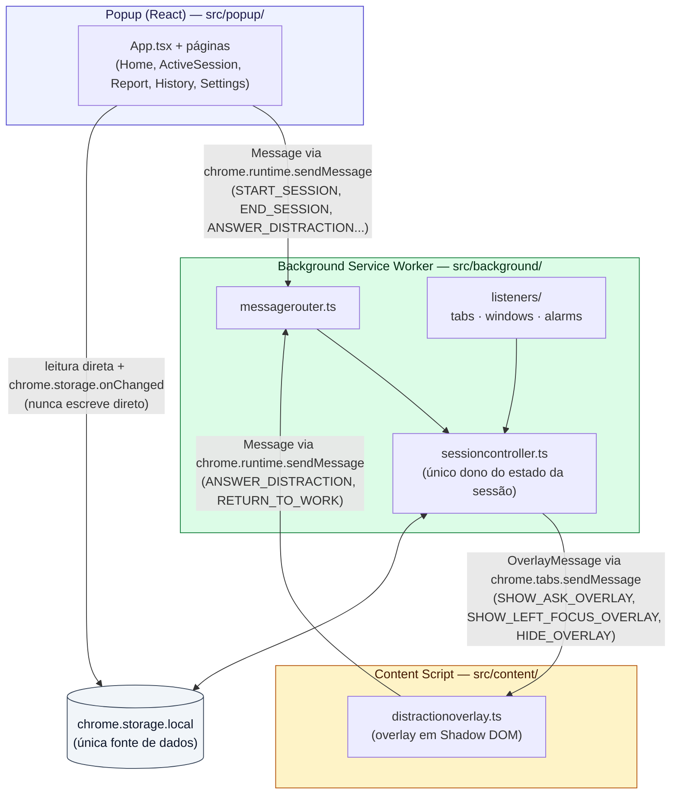
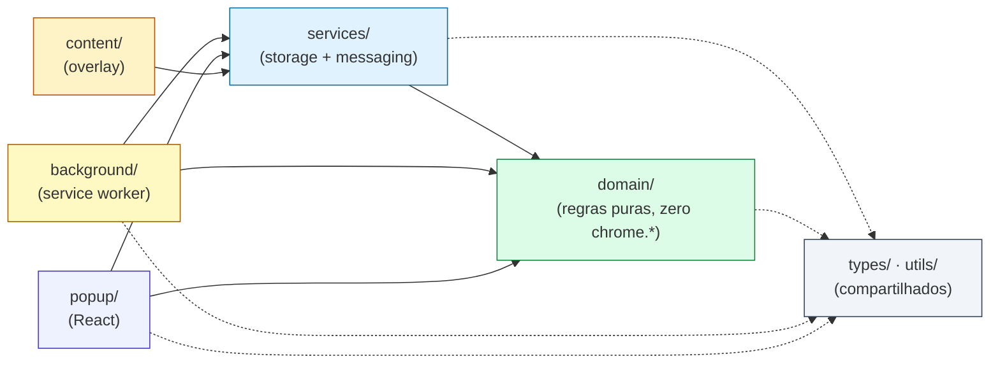
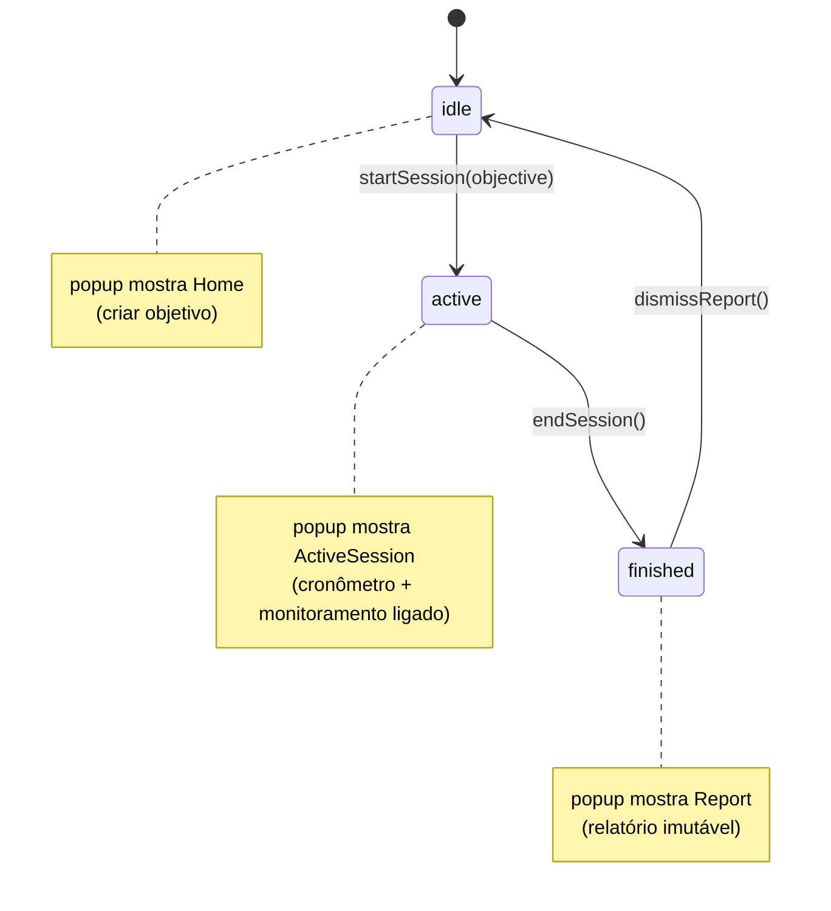
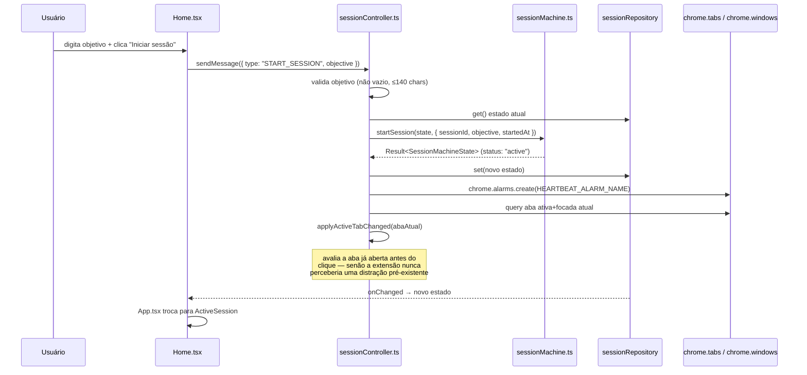
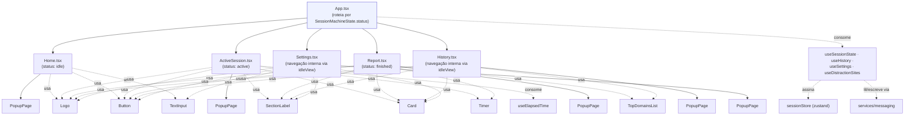
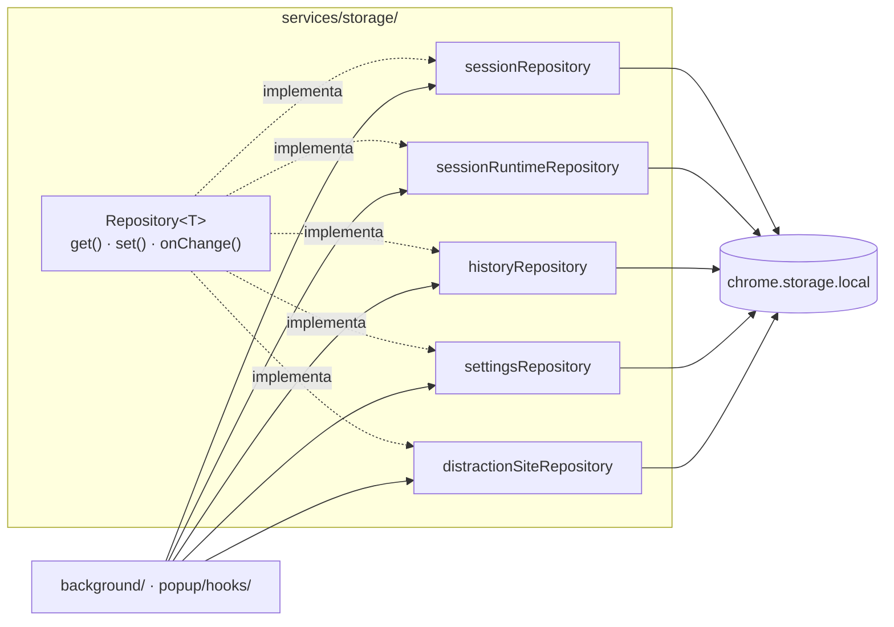
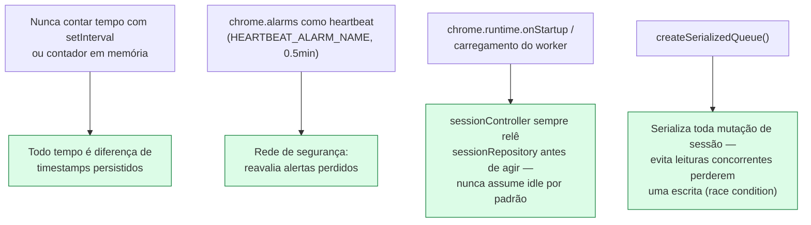
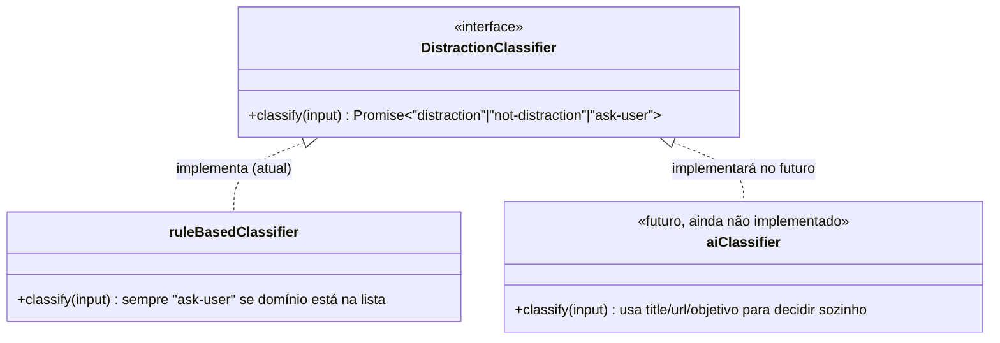

# FocusFlow — Arquitetura do Sistema

> **Este documento é a fonte única de verdade sobre a arquitetura técnica do FocusFlow** — normativa (o "porquê" de cada decisão) e visual ("como construído", com diagramas Mermaid). Todos os diagramas foram conferidos contra o código real em `src/`. As regras de negócio que esta arquitetura sustenta estão em `docs/historias_usuario.md`; este documento nunca redefine regra de negócio, apenas descreve **como** o sistema é construído para cumpri-las.
>
> Princípio-guia: **o produto não tem IA hoje, mas a arquitetura já tem um "buraco" pronto para encaixar a IA no futuro sem reescrever o núcleo** (ver seção 11).

---

## 1. Visão geral — os três processos do Manifest V3

A extensão roda como três processos isolados do Chrome, que só se falam por mensagens — nunca por memória compartilhada.



**Regra #1 da arquitetura:** o popup nunca decide nada sozinho. Ele só lê estado (storage ou mensagens) e envia *intenções* (`START_SESSION`, `ANSWER_DISTRACTION`...). Quem decide se a transição é válida é sempre `sessionController.ts`, porque é o único processo garantido a sobreviver entre a criação do estado e sua leitura — o service worker do MV3 pode ser encerrado e reiniciado a qualquer momento, e o popup é ainda mais efêmero (fecha ao perder foco).

O content script, por sua vez, também é "burro" pelo mesmo motivo: ele só desenha o que a mensagem `OverlayMessage` manda e traduz cliques do usuário de volta em `Message`. Ele nunca decide sozinho se algo é distração.

> **Nota de decisão:** a extensão originalmente usava `chrome.notifications` (notificação nativa do sistema operacional) como único mecanismo do alerta de confirmação. Na prática, o macOS pode agrupar/atrasar essas notificações silenciosamente (ex.: recurso "Resumir notificações"), fazendo o alerta nunca aparecer na tela mesmo com a permissão concedida — o que quebra o mecanismo central do produto (ver `docs/historias_usuario.md` seção 1). Por isso o alerta passou a ser renderizado dentro da própria página, via content script, que não depende de nenhuma configuração de notificação do sistema operacional. `chrome.notifications` foi removido do manifest; o content script é o único canal do alerta.

---

## 2. Stack técnica

| Camada | Escolha | Por quê |
|---|---|---|
| Linguagem | TypeScript (strict mode) | Tipagem completa evita bugs de contrato entre popup ↔ background. |
| UI | React 19 | Popup e telas de histórico/configurações são componentes React. |
| Build | Vite + `@crxjs/vite-plugin` | HMR real para extensões MV3, evita o ciclo lento de "editar → rebuild manual → recarregar extensão". |
| Estilo | Tailwind CSS 4 | UI consistente sem CSS customizado espalhado. |
| Estado no popup | `zustand` (store leve) alimentado por mensagens do background | Evita prop-drilling e Context API pesado para um popup pequeno; fácil de testar. |
| Persistência | `chrome.storage.local`, acessada **apenas** através de uma camada de repositório (seção 9) | Nunca acessar `chrome.storage` diretamente de componentes React — sempre via `services/storage`. |
| Testes unitários | Vitest + Testing Library | Mesma toolchain do Vite, zero configuração adicional. |
| Mock de Chrome APIs | `@types/chrome` + mocks manuais em `tests/mocks` | Permite testar `background/` sem navegador real. |
| Lint/format | ESLint + Prettier | Código modular e tipado, com padrão consistente. |
| Gerenciador de pacotes | pnpm | Mais rápido e com melhor isolamento de dependências que npm/yarn. |

---

## 3. Regra de dependência entre camadas do código



- `domain/` nunca importa nada de fora — é TypeScript puro, testável sem qualquer mock de Chrome.
- `services/` pode importar `domain/`, nunca importa `popup/`.
- `background/` importa `domain/` e `services/`, nunca importa `popup/`.
- `popup/` importa `domain/` (tipos e funções puras) e `services/messaging`, nunca acessa `chrome.storage` diretamente.
- `content/` só importa `services/messaging` (para enviar/receber mensagens tipadas).

Essa regra é o que permite trocar o classificador de distração (regra fixa → IA no futuro, seção 11) sem tocar em `background/` nem `popup/`, e é o que mantém `domain/` barato de testar.

---

## 4. Estrutura de pastas real (`src/`)

```
src/
├── domain/                          # regras de negócio puras
│   ├── session/
│   │   ├── sessionMachine.ts        # idle → active → finished
│   │   ├── scoring.ts               # pontuação 0–100
│   │   ├── sessionMetrics.ts        # agrega DistractionEvent[] em SessionReport
│   │   └── timeClassification.ts    # classifica tempo em focado/distraído/neutro
│   ├── distraction/
│   │   ├── domainMatcher.ts         # match de domínio/subdomínio
│   │   ├── deduplication.ts         # regra "não pergunta 2x após Sim"
│   │   ├── classifier.ts            # interface DistractionClassifier (ponto de extensão p/ IA)
│   │   └── ruleBasedClassifier.ts   # implementação atual da interface acima
│   └── types.ts                     # Session, Objective, DistractionEvent, Settings...
│
├── background/                      # service worker
│   ├── index.ts                     # entrypoint: registra listeners + roteia mensagens
│   ├── messageRouter.ts             # Message → função do sessionController
│   ├── sessionController.ts         # ÚNICO dono do estado da sessão (arquivo central)
│   ├── runDetached.ts               # log de erros não tratados em listeners "fire-and-forget"
│   └── listeners/
│       ├── tabs.ts                  # chrome.tabs.onActivated / onUpdated
│       ├── windows.ts               # chrome.windows.onFocusChanged
│       └── alarms.ts                # chrome.alarms.onAlarm (visita + heartbeat)
│
├── popup/                           # UI React
│   ├── App.tsx                      # roteamento por estado da máquina de sessão
│   ├── main.tsx
│   ├── pages/                       # Home, ActiveSession, Report, History, Settings
│   ├── components/                  # Button, Card, Logo, PopupPage, SectionLabel,
│   │                                 # TextInput, Timer, TopDomainsList
│   ├── hooks/                       # useSessionState, useHistory, useSettings,
│   │                                 # useDistractionSites, useElapsedTime, useRepositoryState
│   └── store/
│       └── sessionStore.ts          # zustand, populado via useSessionState
│
├── services/                        # infraestrutura compartilhada
│   ├── storage/
│   │   ├── repository.ts            # Repository<T> genérico sobre chrome.storage.local
│   │   ├── sessionRepository.ts
│   │   ├── sessionRuntimeRepository.ts  # estado efêmero de monitoramento (visita atual)
│   │   ├── historyRepository.ts
│   │   ├── settingsRepository.ts
│   │   ├── distractionSiteRepository.ts
│   │   └── schemaVersion.ts
│   └── messaging/
│       ├── messages.ts              # union Message (popup/content → background)
│       ├── overlay.ts               # union OverlayMessage (background → aba específica)
│       └── sendMessage.ts           # wrapper tipado sobre chrome.runtime.sendMessage
│
├── content/
│   └── distractionOverlay.ts        # renderiza o overlay em Shadow DOM
│
├── types/                           # tipos globais (Result<T>, etc.)
└── utils/                           # formatDate, formatDuration, id, url, serialized, logRejection

manifest.config.ts                   # manifest MV3 gerado via @crxjs/vite-plugin
```

> Os nomes de arquivo acima são os nomes reais em disco (TypeScript usa `camelCase` para módulos e `PascalCase` para componentes React, ex.: `sessionController.ts`, `ActiveSession.tsx`) — a única exceção de caixa nesta página são os diagramas Mermaid da seção 1, onde os nós usam identificadores em minúsculas por limitação de renderização do próprio Mermaid.

---

## 5. Máquina de estados da sessão



A sessão é modelada como uma **máquina de estados finita explícita**, não como flags booleanas soltas (`isActive`, `isPaused` etc. espalhadas). Isso evita estados impossíveis (ex.: sessão "finalizada e ativa" ao mesmo tempo).

Implementada em `src/domain/session/sessionMachine.ts` como três funções puras (`startSession`, `endSession`, `dismissReport`) que recebem o estado atual e retornam `Result<SessionMachineState>` — uma transição inválida (ex.: `endSession` a partir de `idle`) retorna `{ ok: false, reason }` em vez de lançar exceção ou mudar de estado silenciosamente. `sessionController.ts` é o único chamador dessas funções; o popup nunca as invoca diretamente.

---

## 6. Fluxo: iniciar sessão



---

## 7. Fluxo: detecção de distração e resposta do usuário

Este é o mecanismo central do produto — a "pergunta de confirmação consciente".

```mermaid
sequenceDiagram
    participant Tab as Aba do navegador
    participant TL as listeners/tabs.ts
    participant SW as sessionController.ts
    participant Alarm as chrome.alarms
    participant CS as distractionOverlay.ts
    participant U as Usuário

    Tab->>TL: onActivated / onUpdated (troca de domínio)
    TL->>SW: handleActiveTabChanged({ tabId, url })
    SW->>SW: extractHostname(url) + isDistractionDomain()
    alt domínio não é distração
        SW->>SW: registra como lastProductiveTab
    else domínio é distração
        SW->>Alarm: alarms.create(alarmName, { when: now + minAlertSeconds*1000 })
        SW->>SW: salva currentVisit no sessionRuntimeRepository
    end

    Alarm-->>SW: onAlarm (tempo mínimo atingido)
    SW->>SW: triggerAlert() — cria DistractionEvent(answer: "unanswered")
    alt notificações desativadas
        Note over SW: evento fica "unanswered";<br/>será classificado como distraído<br/>ao fim da visita, sem overlay
    else notificações ativadas
        SW->>CS: sendToTab(tabId, SHOW_ASK_OVERLAY)
        CS->>U: overlay "Você entrou em X. Faz parte do objetivo?"
        U->>CS: clica Sim ou Não
        CS->>SW: sendMessage(ANSWER_DISTRACTION, answer)
        SW->>SW: atualiza DistractionEvent.answer
        alt answer = "no"
            SW->>CS: sendToTab(tabId, SHOW_LEFT_FOCUS_OVERLAY)
            CS->>U: overlay "Você saiu do foco" + botão "Voltar ao trabalho"
            U->>CS: clica "Voltar ao trabalho" (opcional)
            CS->>SW: sendMessage(RETURN_TO_WORK)
            SW->>SW: reativa lastProductiveTab (ou cria aba nova)
        else answer = "yes"
            SW->>CS: sendToTab(tabId, HIDE_OVERLAY)
        end
    end
```

Pontos que só ficam claros lendo o código (`src/background/sessionController.ts`):

- **Fila serializada (`createSerializedQueue`)**: eventos de `tabs`/`windows`/`alarms` podem chegar fora de ordem e se sobrepor — o service worker processa um handler assíncrono por vez, mas dois handlers podem estar "em voo" simultaneamente. Sem serializar, duas chamadas concorrentes poderiam ler o mesmo estado de sessão antes de qualquer uma escrever de volta, perdendo uma delas. Toda mutação de sessão passa por uma fila (`utils/serialized.ts`) que garante que um `get → modifica → set` nunca se intercale com outro sobre o mesmo estado.
- **Alarme avulso por visita, não heartbeat**: cada visita a um domínio de distração cria seu próprio alarme (`when: entradaEm + minAlertSeconds*1000`), cancelado se a visita terminar antes. Um id por visita (não `tabId`+timestamp) evita colisão quando o usuário sai e volta para a mesma aba dentro do mesmo milissegundo. O heartbeat periódico (`HEARTBEAT_ALARM_NAME`) existe só como rede de segurança, reavaliando se um alarme avulso foi perdido.
- **Injeção sob demanda do content script**: `sendToTab` tenta `chrome.tabs.sendMessage` primeiro; se falhar (aba já estava aberta antes da extensão carregar — o Chrome só injeta `content_scripts` declarados no manifest em navegações que acontecem *depois* da extensão estar carregada), injeta o content script via `chrome.scripting.executeScript` (permissão `scripting`) e tenta de novo antes de desistir. Só depois dessa segunda tentativa falhar é que a falha é absorvida como esperada (página não-http/https tipo `chrome://`, aba fechada durante o envio).

---

## 8. Componentes do Popup (árvore React)



`App.tsx` não tem rotas no sentido de um router tradicional — a "navegação" macro (Home / ActiveSession / Report) é 100% derivada do `status` da máquina de estados (vindo do background via `useSessionState`), e a navegação secundária dentro de `idle` (Home ↔ History ↔ Settings) é um `useState<IdleView>` local, sem persistência. Nenhum componente de página acessa `chrome.*` diretamente — tudo passa pelos hooks em `popup/hooks/`. Nenhuma lógica de negócio vive dentro de componentes React — componentes só chamam hooks, que por sua vez conversam com `services/messaging`. Isso mantém `popup/` "burro" de propósito.

---

## 9. Camada de armazenamento (Repository Pattern)



Toda entidade (`Session`, `SessionRuntimeState`, `History`, `Settings`, `DistractionSite`) tem um repositório concreto criado por `createChromeStorageRepository<T>()`, que:

1. Envelopa o valor salvo com `{ version, value }` (`schemaVersion.ts`) para permitir migração futura sem quebrar dados antigos. Ao adicionar campos novos no roadmap, o repositório pode aplicar uma função de migração na leitura, evitando quebrar dados salvos por versões antigas da extensão.
2. Expõe `onChange()` sobre `chrome.storage.onChanged`, permitindo que o popup reaja a mudanças feitas pelo background sem polling.
3. Garante que nenhum componente React ou listener de background leia/escreva `chrome.storage` diretamente — sempre por essa interface.

`sessionRuntimeRepository` merece nota à parte: guarda estado *efêmero* de monitoramento (`currentVisit`, `lastProductiveTab`) que não faz parte do domínio de negócio da sessão em si, mas precisa sobreviver a reinícios do service worker do mesmo jeito que o resto.

Quota do `chrome.storage.local`: não há limite de retenção implementado hoje (ver `docs/historias_usuario.md` seção 11), mas a interface do repositório já suporta paginação/corte, para não exigir refatoração caso isso se torne um problema real.

---

## 10. Resiliência do Service Worker (MV3)

O maior risco técnico do MV3 é o service worker ser encerrado pelo Chrome após ~30s de inatividade, perdendo qualquer estado em memória. A arquitetura resolve isso com quatro mecanismos combinados:



Notas de precisão registradas durante o desenvolvimento:

- O heartbeat de 20-30s é bom para manter o service worker acordado, mas não é suficiente sozinho para cumprir a regra de "tempo mínimo para alerta" (default de 5s) sem atraso perceptível — um heartbeat de 30s poderia atrasar um alerta configurado para 5s em até ~25s. Por isso, o alerta de cada visita a um domínio de distração usa um alarme **avulso por visita** (`when`, não `periodInMinutes`), cancelado se a visita terminar antes de disparar. O heartbeat periódico continua existindo, mas como **rede de segurança**, não como o mecanismo primário de disparo do alerta.
- O heartbeat (`HEARTBEAT_ALARM_NAME`, `periodInMinutes: 0.5`) só tem granularidade de 30s em modo desenvolvedor/não empacotado — o Chrome arredonda `periodInMinutes` para o mínimo de 1 minuto em extensões empacotadas/publicadas. Isso é aceitável porque o heartbeat é só rede de segurança — o mecanismo primário continua sendo o alarme avulso por visita, que não tem esse limite por ser `when`, não `periodInMinutes`.
- Toda a lógica de retomada de sessão vive em `sessionController.ts`: ao inicializar (`chrome.runtime.onStartup` / carregamento do service worker), ele sempre relê o estado do `sessionRepository` antes de decidir o que fazer — nunca assume estado `idle` por padrão.

---

## 11. Ponto de extensão para IA (roadmap futuro) — Strategy Pattern



`domain/distraction/classifier.ts` define a interface; `ruleBasedClassifier.ts` é a única implementação existente e olha exclusivamente para `domain` contra a lista de `DistractionSite` — sempre delega a decisão final ao usuário (`"ask-user"`), nunca decide sozinho que algo é distração (consistente com o item "não usa IA" do escopo, `docs/historias_usuario.md` seção 2).

Uma futura implementação baseada em IA (`aiClassifier.ts`) poderá usar `title`/`url` e o objetivo da sessão para decidir automaticamente `"distraction"` ou `"not-distraction"` sem perguntar ao usuário — plugada no mesmo ponto, trocando apenas qual implementação é injetada em `sessionController.ts`. Isso significa que `background/`, `popup/` e a camada de storage **não precisam mudar uma linha** quando isso acontecer — só se adiciona uma nova implementação da interface e um mecanismo de configuração para escolher qual classificador está ativo. Esse design também facilita testes: hoje o `ruleBasedClassifier` é testado isoladamente sem qualquer mock de rede/IA.

---

## 12. Comunicação entre contextos — dois canais propositalmente separados

| Canal | Tipo | Direção | Transporte | Arquivo |
|---|---|---|---|---|
| `Message` | `START_SESSION` \| `END_SESSION` \| `DISMISS_REPORT` \| `ANSWER_DISTRACTION` \| `RETURN_TO_WORK` | popup/content → background | `chrome.runtime.sendMessage` | `services/messaging/messages.ts` |
| `OverlayMessage` | `SHOW_ASK_OVERLAY` \| `SHOW_LEFT_FOCUS_OVERLAY` \| `HIDE_OVERLAY` | background → uma aba específica | `chrome.tabs.sendMessage(tabId, ...)` | `services/messaging/overlay.ts` |

São canais separados porque só o background sabe qual `tabId` corresponde à visita de distração em andamento (`SessionRuntimeState.currentVisit.tabId`) — não faz sentido um broadcast genérico quando o destino é sempre uma aba específica e endereçável. `services/messaging/sendMessage.ts` encapsula `chrome.runtime.sendMessage` com tipagem de retorno, para que o popup nunca precise dar cast manual.

Permissão de host: como a lista de domínios de distração é editável pelo usuário, o content script precisa poder rodar em qualquer domínio — não dá para restringir `matches` aos 10 domínios default. `manifest.config.ts` declara `content_scripts` com `matches: ["http://*/*", "https://*/*"]`. Isso é uma exceção deliberada à prática geral de "evitar permissão de host ampla" (seção 15): o content script em si não lê DOM/conteúdo da página (só desenha um overlay quando instruído), então o risco de superfície é limitado a "consegue mostrar uma UI própria em qualquer aba", não a "consegue ler dados de qualquer aba".

---

## 13. Testes

- **`domain/`**: cobertura de testes unitários alta (é lógica pura, barata de testar) — especialmente `scoring.ts`, `timeClassification.ts` e `domainMatcher.ts`, que são as regras mais sensíveis a erro silencioso.
- **`services/storage`**: testado com um mock de `chrome.storage.local` (objeto em memória) para validar serialização e migração de schema.
- **`background/listeners`**: testado com mocks de `chrome.tabs`/`chrome.windows`, validando que a sequência de eventos gera as transições de estado corretas.
- **`popup/`**: testes de componente (Testing Library) focados em comportamento (ex.: "botão iniciar desabilitado se objetivo vazio"), não em detalhes de implementação.
- Não há testes E2E completos de extensão (ex.: Playwright controlando o Chrome real) — considerado roadmap técnico, não bloqueante.

---

## 14. Convenções de código

- TypeScript em modo `strict`, sem `any` implícito. `unknown` + narrowing quando necessário.
- Nomes de arquivos em `camelCase` para módulos, `PascalCase` para componentes React.
- Path aliases (`@domain/*`, `@services/*`, `@background/*`, `@popup/*`) configurados no `tsconfig.json` e no Vite, para evitar `../../../../` em imports.
- Nenhuma lógica de negócio dentro de componentes React — componentes só chamam hooks (`useSessionState` etc.), que por sua vez conversam com `services/messaging`.
- Constantes de configuração (pesos da pontuação, lista default de domínios, tempo mínimo de alerta default) ficam centralizadas em `domain/session/scoring.ts` e `services/storage/settingsRepository.ts` (valores default), nunca espalhadas/hardcoded em componentes.

---

## 15. O que explicitamente NÃO fazer (riscos de over-engineering)

Assim como `docs/historias_usuario.md` define o que o produto não é, esta seção define o que a arquitetura **não deve** ganhar prematuramente:

- ❌ Não introduzir Redux, Redux-Saga ou outra store pesada — `zustand` + `chrome.storage.onChanged` é suficiente para o tamanho do popup.
- ❌ Não criar um "message bus" genérico ou sistema de plugins complexo para o classificador — a interface simples de Strategy (seção 11) já resolve o problema real sem abstração especulativa adicional.
- ❌ O content script (seção 1 e 7) existe **só** para desenhar o overlay de confirmação. Não usá-lo para ler título/DOM/conteúdo semântico da página, nem para qualquer outra funcionalidade — isso continua fora de escopo (ver ponto de extensão de IA, seção 11).
- ❌ Não criar camada de API/backend "para o futuro" — o produto é 100% local; se e quando sincronização remota for decidida, isso vira sua própria arquitetura.
- ❌ Não abstrair `chrome.storage.local` para múltiplos backends de persistência (ex.: IndexedDB) sem necessidade real comprovada — o repositório existe para isolar chamadas, não para suportar múltiplos providers hipotéticos hoje.

---

## 16. Tabela de arquivos-chave por responsabilidade

| Responsabilidade | Arquivo |
|---|---|
| Máquina de estados da sessão | `src/domain/session/sessionMachine.ts` |
| Cálculo de pontuação | `src/domain/session/scoring.ts` |
| Classificação de tempo focado/distraído | `src/domain/session/timeClassification.ts` |
| Agregação do relatório final | `src/domain/session/sessionMetrics.ts` |
| Match de domínio/subdomínio | `src/domain/distraction/domainMatcher.ts` |
| Deduplicação de alertas | `src/domain/distraction/deduplication.ts` |
| Orquestração central (único dono do estado) | `src/background/sessionController.ts` |
| Roteamento de mensagens do popup/content | `src/background/messageRouter.ts` |
| Listeners de tabs/janelas/alarmes | `src/background/listeners/*.ts` |
| Renderização do overlay in-page | `src/content/distractionOverlay.ts` |
| Envio de mensagem para aba específica + injeção sob demanda | `src/services/messaging/overlay.ts` |
| Repositório genérico sobre `chrome.storage.local` | `src/services/storage/repository.ts` |
| Estado efêmero de monitoramento (visita atual) | `src/services/storage/sessionRuntimeRepository.ts` |
| Roteamento de telas do popup | `src/popup/App.tsx` |
| Manifest MV3 | `manifest.config.ts` |
